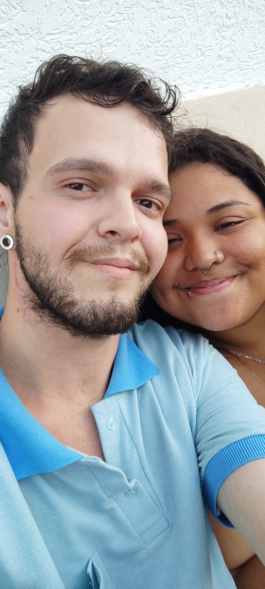
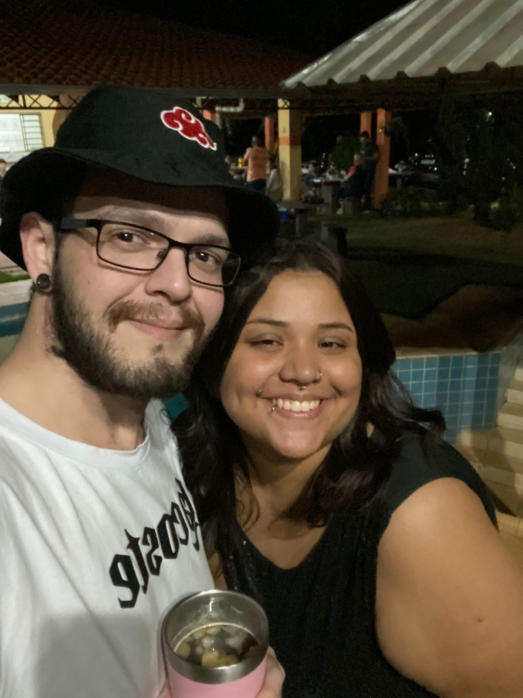
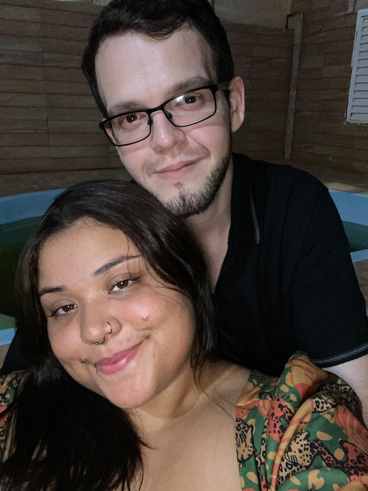
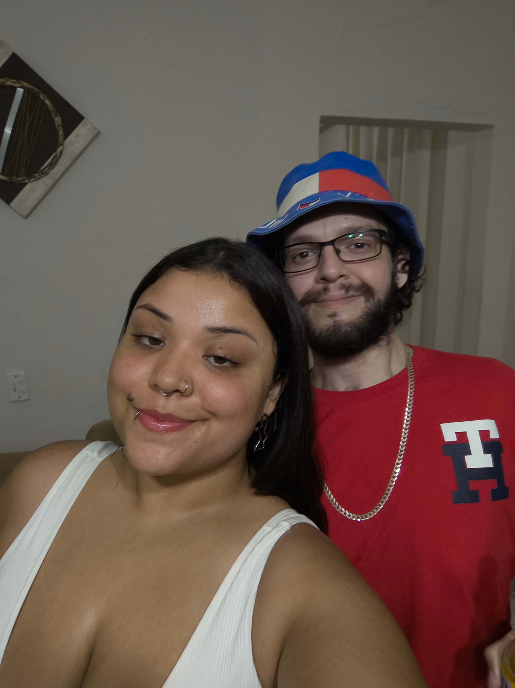

<head>
  <meta charset="UTF-8">
  
  <meta name="viewport" content="width=device-width, initial-scale=1.0">
</head>

<html lang="pt-BR">

<body>

  <section>
    <h1>Dois anos… de muito amor🖤</h1>
    
Inicialmente isso era apenas uma página em branco, mas nós escrevemos nossas histórias então aí vai pedacinho da nossa história, feito só pra você.

  </section>

  

  <section>
    <h2>Nossa História</h2>
    

      Há dois anos atrás, um guerreiro caucasiano e em seu auge da juventude decidiu encarar o tinder para sair da monotonia
      autodestrutiva na qual ele vivia, durante sua missão este jovem conheceu uma bela moça, pela qual o mesmo ficou fascinado...
      Com pouco tempo se conhecendo ele já sabia que queria vê-la pessoalmente, ele queria ver com seus próprios olhos aquela beleza
      que ele via pela tela de seu celular.
      Foi então que o guerreiro decidiu com toda a sua miserável força, chamar a bela moça para sair, mas a bela moça... Não respondeu!
      Entretanto no dia seguinte ela explicou que ela sofria de uma maldição imposta por uma bruxa, que a fazia dormir muito e explicou
      que em qualquer momento e em qualquer lugar ela adormece, apos analises meticulosas sobre a maldição da bruxa, o jovem guerreiro
      conseguiu quebrar a maldição e então bruxa marcar de sair com a sua princesa, o tempo passou... decidiram namorar, desde o inicio eles vem se cuidando, se amando,
      aprendendo, caindo e também levantando e como bons guerreiros também lutando, contra as inseguranças, paranoias, medos e diferenças,
      todos os dias continuam lutando, para que no final eles encontrem o final feliz!! 
      Mas por fora dessa narrativa diferente do inicio de nossa historia, eu quero que você saiba que eu te amo muito e que estarei aqui pra ti!
      Feliz 2.0 anos meu amor, meu moranguete 🖤🖤🖤🖤🖤🖤
      
  

  </section>

  

  <section>
    <h2>Por que eu te amo!?</h2>
    
• Seu sorriso muda meu dia

    
• Seu abraço acalma tudo

    
• Porque com você tudo fica mais prazeroso

    
• Porque você é minha escolha todos os dias

    
• Porque você me apoia sempre

    
• Por você me amar calmamente 

    
• Pela sua lealdade comigo 

    
• Porque você me motiva 

    
• Porque é você que eu vejo ao meu lado 

    
• E é você que eu quero! 

    
  </section>

  

  <section class="gallery">
  <h2>Nossos Momentos</h2>

  <figure class="photo">
    
    <figcaption>📅 30/01/24 — 0.0</figcaption>
  </figure>

  <figure class="photo">
    
    <figcaption>📅 03/08/24 — 0.6</figcaption>
  </figure>

<figure class="photo">
    
    <figcaption>📅 25/12/24 — 1.0(quase)</figcaption>
  </figure>

<figure class="photo">
    
    <figcaption>📅 10/08/25 — 1.6</figcaption>
  </figure>

<figure class="photo">
    
    <figcaption>📅 10/08/25 — 2.0</figcaption>
  </figure>

</section> 

  

  <section>
    <h2>Mensagem Final</h2>
    

      Amar você nesses dois anos foi fácil. 
      Continuar escolhendo você é ainda mais simples.  
      Feliz 2 anos pra nós ❤️
    

  </section>

  <footer>
    Feito com amor🖤
    Ass: Nerd Gostoso
  </footer>

</body>
</html>
